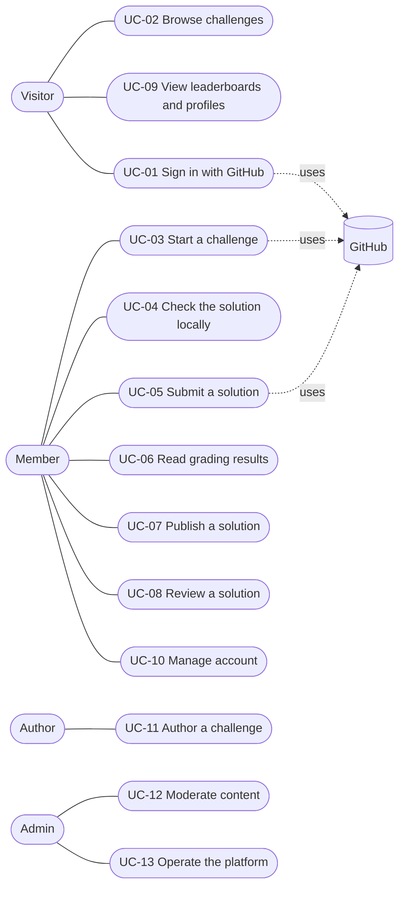

# Forge (working name): Requirements

| | |
|---|---|
| Document | 01 of 02. The architecture lives in `02-architecture.md`. |
| Version | 0.1 (draft) |
| Date | 21 August 2026 |
| Owner | Philip Olaomo |
| Audience | Anyone who wants to understand what we are building and why. No technical background needed for sections 1 to 8. |

**How to read this.** Sections 1 to 6 explain the idea, who it is for and what is in and out of scope. Sections 7 and 8 describe what people can do with it (use cases and user stories). Sections 9 and 10 are the formal requirement lists: what the system must do (functional) and how well it must do it (non-functional). Terms in *italics* are explained in the glossary at the end of the architecture document.

---

## 1. The idea in one paragraph

Forge is a website where developers pick a realistic app to build, choose the programming language they want to build it in, get a set of starter files, build the app on their own machine, push it to GitHub and submit it. A marking system then runs their app, talks to it the way a real client would, and gives them a score with a clear explanation. Scores feed a profile and leaderboards, and finished solutions can be read and reviewed by other members. Think of Frontend Mentor, but the thing you build is a working backend or full-stack app, in Java, Python, Go, PHP or any other language you like.

## 2. The problem we are solving

- Frontend Mentor proved that "show me you can build this" beats "tell me you can". Nothing equivalent exists for backend and full-stack work.
- Most backend practice is either puzzles (LeetCode style) or rebuilding famous tools (Redis, Git). Neither looks like the job.
- Juniors have tutorial projects that look like everyone else's. Employers want proof of something real.
- Existing platforms lock you into one language or one framework. Real teams let you pick.

## 3. Vision, goals and success measures

### 3.1 Vision

The place where developers prove they can build real apps, in the stack they actually use.

### 3.2 Business goals

| ID | Goal | How we will know |
|---|---|---|
| B1 | Become the default place for backend and full-stack practice projects | 1,000 registered members and 300 graded submissions within six months of public launch |
| B2 | Stay cheap to run while small | Hosting under 50 EUR per month until 5,000 members |
| B3 | Be trustworthy for employers | A completed challenge on a profile is accepted as portfolio evidence by at least three hiring partners by v2 |
| B4 | Earn money without ads | First revenue from sponsored challenges or a Pro tier in v2 |

### 3.3 User goals

| ID | Goal |
|---|---|
| U1 | Find a challenge that matches my level and my language in under two minutes |
| U2 | Start building within five minutes of deciding, with files that already work |
| U3 | Know exactly why I failed a check, in plain words, without guessing |
| U4 | Show a verified result to an employer with one link |
| U5 | See how I compare with people who use the same language as me |
| U6 | Get feedback from real people, not only from the machine |

### 3.4 Quality goals (the three things we will not compromise on)

| Priority | Quality | What it means for us |
|---|---|---|
| 1 | Usability and UX | Fast pages, works on a phone, nothing confusing, every error tells you what to do next |
| 2 | Portability | The whole system runs anywhere that runs Docker. No feature depends on one cloud provider. |
| 3 | Scalability | More traffic or more submissions means adding copies of things, not rewriting them |

Security is not ranked because it is not optional: the system runs code written by strangers, so isolation is a hard rule, not a goal we trade against others.

## 4. Stakeholders

| Who | What they care about |
|---|---|
| Developers (members) | Good challenges, fair grading, clear feedback, a profile worth sharing |
| Challenge authors | Publishing a challenge without touching platform code, tests that do not flake |
| Owner and admin (Philip) | Low cost, low maintenance, everything starts with one command, nothing pages you at 3 a.m. |
| Hiring partners (v2) | Trusting the score, finding strong people, replacing take-home tests |
| GitHub | We depend on it for sign-in, repositories and webhooks |
| Hosting provider | Interchangeable by design; we must not depend on any one of them |

## 5. Personas

### Amara, 24, junior developer, Manchester

Finished a bootcamp eight months ago. Writes Python. Has three tutorial projects that look like everyone else's. Applies to jobs and hears nothing back.

- Wants: a real project that someone other than herself has graded, and a link she can put on her CV.
- Frustrations: does not know if her code is "good enough"; big open-ended projects overwhelm her; vague error messages make her give up.
- Success looks like: two junior challenges completed with scores above 80, profile link in every application, one review from a more senior member.

### Jonas, 29, mid-level Java developer, Frankfurt

Five years at an insurance company. Solid at Spring Boot, curious about Go. Wants to know how he ranks outside his own team.

- Wants: a mid-level challenge that feels like work, the freedom to do it in Go, and a leaderboard that compares him with other Go developers.
- Frustrations: LeetCode does not feel like his job; side projects die because nobody looks at them.
- Success looks like: a mid challenge completed in Go, top 20 on the Go board, two useful reviews on his solution, and a habit of reviewing others.

### Lena, 38, senior engineer and challenge author, remote

Loves writing specifications and tests. Wants to contribute challenges.

- Wants: a repeatable authoring process, a checklist that catches her mistakes, and zero platform code to learn.
- Frustrations: flaky tests that fail good solutions; tests that pass bad ones.
- Success looks like: a new challenge live in two days with no false failures in its first month.

### Philip, owner and admin

Runs the platform alone at first, on a student budget and limited hours.

- Wants: one command to run everything locally, one image per deployable, clear logs, cheap hosting, and the ability to move providers in an afternoon.
- Frustrations: services that need babysitting, vendor features that trap you, grading failures that cannot be explained.
- Success looks like: a week without touching the server, and a clear dashboard when he does.

### Daniel, 41, CTO at a 40-person startup (v2, not in scope yet)

Hates sending take-home tests. Would sponsor a challenge and look at the top solutions instead.

## 6. Scope

### 6.1 In scope for the MVP

- Backend mode only.
- Three stacks: Python (FastAPI), Java (Spring Boot), Go.
- Six challenges: three junior, two mid, one senior.
- Sign in with GitHub, start a challenge, receive a starter repository, submit, get graded, see a score and a report.
- Profile, global leaderboard, per-stack leaderboard, solution gallery with comments.
- Authoring workflow for challenges (used by the owner for now).

### 6.2 Planned for later

- v1: full-stack mode, PHP and Node stacks, peer reviews with points, badges, monthly boards, hidden test rotation, similarity checks.
- v2: load-tested senior challenges, team challenges, sponsored challenges, Pro tier, AI-assisted code review, community-authored challenges.

### 6.3 Out of scope (not planned)

- A native mobile app. The web app is the product.
- An in-browser code editor. People build on their own machines with their own tools.
- Hosting members' apps for the public. We run them only to grade them.
- Ads.

## 7. Use cases

### 7.1 Overview

Actors: **Member** (a signed-in developer), **Visitor** (not signed in), **Author** (writes challenges), **Admin** (runs the platform), and **GitHub** (an external system we depend on).

| ID | Use case | Actor | Summary |
|---|---|---|---|
| UC-01 | Sign in with GitHub | Visitor | Create an account or sign in using GitHub. No passwords to manage. |
| UC-02 | Browse challenges | Visitor | See all challenges, filter by level, mode and stack. Read the full brief before signing in. |
| UC-03 | Start a challenge | Member | Pick mode and stack, receive a ready-to-run starter repository in their own GitHub account. |
| UC-04 | Check the solution locally | Member | Run the public checks on their own machine with one command, before submitting. |
| UC-05 | Submit a solution | Member | Tell the platform which commit to grade. Watch progress live. |
| UC-06 | Read grading results | Member | See the score, which checks passed or failed and why, in plain language. |
| UC-07 | Publish a solution | Member | Share the solution with a short write-up in the gallery. |
| UC-08 | Review a solution | Member | Read someone's solution and leave a structured review. |
| UC-09 | View leaderboards and profiles | Visitor | See rankings by stack, level and time period. Open any public profile. |
| UC-10 | Manage account | Member | Edit profile, set notification preferences, export or delete the account. |
| UC-11 | Author a challenge | Author | Write the brief, the API contract and the tests, validate them, publish a version. |
| UC-12 | Moderate content | Admin | Hide content, warn or ban members, handle reports. |
| UC-13 | Operate the platform | Admin | Watch the grading queue and worker health, retry or cancel runs, read logs. |

### 7.2 UC-03 Start a challenge (detailed)

- **Actor:** Member
- **Preconditions:** Signed in. GitHub app installed on their account (the platform asks on first use).
- **Main flow:**
  1. Member opens a challenge page and clicks "Start challenge".
  2. Platform asks for the mode (backend, or full-stack once available) and the stack.
  3. Platform generates the starter kit for that combination.
  4. Platform creates a new repository in the member's GitHub account and pushes the starter kit.
  5. Platform shows the repository link and the three steps to get going: clone, run, check.
- **Alternatives:**
  - 4a. Repository creation fails or the member declines GitHub access: the platform offers a zip download instead and asks for a repository URL at submission time.
  - 1a. Member already has this challenge in progress: the platform opens the existing repository instead of creating another one.
- **Postconditions:** An enrollment record exists linking member, challenge version, mode, stack and repository.

### 7.3 UC-05 and UC-06 Submit and read results (detailed)

- **Actor:** Member
- **Preconditions:** An active enrollment with code pushed to the repository.
- **Main flow:**
  1. Member opens the enrollment page and clicks "Submit for grading". The platform records the latest commit on the default branch (the member can pick another commit).
  2. Platform checks the basics immediately: Dockerfile present, `challenge.yml` valid. Problems are shown at once with a fix.
  3. Platform queues a grading job and shows the queue position.
  4. A worker grades the submission. The page updates live: building, starting, running checks, scoring.
  5. Platform shows the score, the result per check group, and one plain sentence for every failed check.
  6. If the score reaches the completion threshold, points are awarded and the leaderboard updates.
- **Alternatives:**
  - 4a. Build fails: the member sees the build log and a hint about the most common cause.
  - 4b. App never answers `/health` in time: the member sees the app logs and the time limit.
  - 4c. The platform itself fails (worker crash, timeout unrelated to the code): the job is retried automatically and never counted as a failed attempt.
- **Postconditions:** A grading run with a stored report exists. The best score for the enrollment is updated if this run is better.

### 7.4 UC-08 Review a solution (detailed)

- **Actor:** Member (the reviewer)
- **Preconditions:** The solution is published. The reviewer has completed at least one challenge (keeps reviews informed).
- **Main flow:**
  1. Reviewer opens a published solution from the gallery.
  2. Reviewer reads the write-up and the code (linked repository, with the grading report visible).
  3. Reviewer writes a review using a short structure: what works well, what to improve, one concrete suggestion.
  4. The author is notified. The author can mark the review as helpful.
  5. A helpful review earns the reviewer points (v1).
- **Alternatives:**
  - 3a. The review breaks the community rules: the author or anyone else can report it; an admin handles it (UC-12).
- **Postconditions:** The review is attached to the solution and visible to everyone.

## 8. User stories

Each story has the form "As a [person], I want [something], so that [reason]". Acceptance criteria are listed where the story is central to the MVP.

### Discover

- **S-01** As a visitor, I want to browse challenges by level and stack, so that I can judge in a minute whether this place is for me.
- **S-02** As a visitor, I want to read the full brief of a challenge without signing in, so that I can decide before I commit.
- **S-03** As a member, I want to see which challenges I have started and finished, so that I always know where I am.

### Start

- **S-04** As a member, I want to choose my language and framework when I start, so that I build in the stack I actually use.
  - Given a challenge page, when I click Start, then I can choose from every enabled stack for that challenge.
- **S-05** As a member, I want a starter repository created in my own GitHub account, so that I own my work from the first minute.
  - Given I approved the GitHub app, when I confirm mode and stack, then a repository exists in my account within 30 seconds containing the brief, the API contract, the Dockerfile, the compose file, the public checks and a README that tells me how to run it.
- **S-06** As a member, I want the starter to run with one command on my machine, so that I spend my time on the challenge and not on setup.
  - Given a fresh clone, when I run `make dev`, then the app starts and answers `/health` within two minutes on a normal laptop.

### Build and check

- **S-07** As a member, I want to run the same public checks locally that the platform will run, so that I never submit blind.
  - Given a running app, when I run `make check`, then I see the same check names and messages the platform would show.
- **S-08** As a member, I want a clear API contract, so that I know exactly what each endpoint must return.

### Submit and grade

- **S-09** As a member, I want to submit with one click and see progress live, so that I am never left wondering.
  - Given I clicked Submit, when the job runs, then the page shows the current stage within five seconds of every change, without me refreshing.
- **S-10** As a member, I want one plain sentence for every failed check, so that I know where to look.
  - Given a failed check, then I see its name, a one-sentence explanation and, where safe, the request that was made and the response I returned.
- **S-11** As a member, I want to resubmit as often as I like within a fair limit, so that I can improve.
- **S-12** As a member, I want platform failures to never count against me, so that I trust the score.

### Rank and show

- **S-13** As a member, I want a public profile that lists what I completed, in which stack, with the score, so that I can share one link with employers.
- **S-14** As a member, I want to see where I rank among people using my stack, so that the comparison is fair.
- **S-15** As a member, I want a badge I can embed in my GitHub README, so that my profile travels with me (v1).

### Community

- **S-16** As a member, I want to publish my solution with a short write-up, so that others can learn from it and I can get feedback.
- **S-17** As a member, I want to comment on and review solutions, so that I learn by reading other people's code.
- **S-18** As a member, I want helpful reviews to earn points, so that giving feedback is rewarded (v1).

### Account

- **S-19** As a member, I want to control which emails I get, so that the platform never becomes noise.
- **S-20** As a member, I want to delete my account and my personal data, so that I stay in control.

### Authoring and operating

- **S-21** As an author, I want a checklist that refuses to publish a challenge whose reference solution does not score 100 or whose deliberately broken solution does not fail, so that tests are trustworthy.
- **S-22** As an author, I want to publish a new version of a challenge without disturbing people who already started the old one, so that nobody's work breaks under them.
- **S-23** As an admin, I want to see the queue, the workers and the last failures on one page, so that I can fix things quickly.
- **S-24** As an admin, I want to retry or cancel a grading run, so that I can unblock members.

## 9. Functional requirements

Priority uses MoSCoW: **Must** (MVP cannot ship without it), **Should** (important, can slip a little), **Could** (nice to have). Release says when we intend to build it.

### 9.1 Accounts and identity

| ID | Requirement | Priority | Release |
|---|---|---|---|
| FR-ACC-01 | Members sign in with GitHub. The platform stores only the GitHub id, handle, display name, avatar and primary email. | Must | MVP |
| FR-ACC-02 | Members have a public profile page showing completed challenges, stack, mode, score and links to published solutions. | Must | MVP |
| FR-ACC-03 | Members can edit their display name, a short bio and links. | Should | MVP |
| FR-ACC-04 | Members can choose which email notifications they receive. | Must | MVP |
| FR-ACC-05 | Members can export their data and delete their account. Deletion removes personal data and anonymises anything that must be kept for integrity (see NFR-D2). | Must | MVP |
| FR-ACC-06 | Roles: member, author, admin. Authors and admins are assigned by an admin. | Must | MVP |

### 9.2 Catalogue

| ID | Requirement | Priority | Release |
|---|---|---|---|
| FR-CAT-01 | The catalogue lists all published challenges with title, level, available modes, enabled stacks, base points and completion count. | Must | MVP |
| FR-CAT-02 | Visitors can filter by level, mode and stack, and sort by newest, most completed and points. | Must | MVP |
| FR-CAT-03 | Every challenge has a public page with the full brief, the API contract rendered in a readable form, the rubric weights and sample solutions once any exist. | Must | MVP |
| FR-CAT-04 | Challenges are versioned. A member always stays on the version they started. | Must | MVP |
| FR-CAT-05 | Challenge pages show aggregate stats: completion rate, average score, most used stack. | Could | v1 |

### 9.3 Enrollment and starter kits

| ID | Requirement | Priority | Release |
|---|---|---|---|
| FR-ENR-01 | A member starts a challenge by choosing a mode (backend at MVP, full-stack from v1) and a stack from the enabled list. | Must | MVP |
| FR-ENR-02 | The platform generates a starter kit from the stack template plus the challenge content, filtered by mode. | Must | MVP |
| FR-ENR-03 | Every starter kit contains: the brief as README, `openapi.yaml`, `challenge.yml`, a Dockerfile, a compose file with the required services, route stubs for every endpoint, the public checks and a CI workflow that runs them. | Must | MVP |
| FR-ENR-04 | The platform creates a repository in the member's GitHub account and pushes the starter kit. | Must | MVP |
| FR-ENR-05 | If repository creation is not possible, the platform offers a zip download and accepts a repository URL later. | Should | MVP |
| FR-ENR-06 | A member has at most one active enrollment per challenge. They can abandon it and start again. | Must | MVP |
| FR-ENR-07 | The local check command runs the identical public checks the platform runs, with identical names and messages. | Must | MVP |

### 9.4 Submission

| ID | Requirement | Priority | Release |
|---|---|---|---|
| FR-SUB-01 | A member submits from the enrollment page. The platform records the chosen commit SHA. | Must | MVP |
| FR-SUB-02 | Pushing a tag that starts with `submit-` also creates a submission (via GitHub webhook). | Should | v1 |
| FR-SUB-03 | Before queueing, the platform validates the repository shape (Dockerfile present, `challenge.yml` valid) and reports problems immediately. | Must | MVP |
| FR-SUB-04 | Submissions are rate limited per member and challenge (default five per hour). | Must | MVP |
| FR-SUB-05 | The submission page shows queue position and the current stage live. | Must | MVP |
| FR-SUB-06 | Members can resubmit. The best completed score counts for points; every run stays visible in history. | Must | MVP |
| FR-SUB-07 | Reports and logs of every run are stored and viewable by the member and admins. | Must | MVP |

### 9.5 Grading

| ID | Requirement | Priority | Release |
|---|---|---|---|
| FR-GRD-01 | The worker clones the repository at the exact submitted commit. | Must | MVP |
| FR-GRD-02 | The worker builds the image with CPU, memory and time limits; the build may reach package registries only through an allowlist. | Must | MVP |
| FR-GRD-03 | The worker starts the app with the services declared in `challenge.yml`, a fresh database and no internet access, in an isolated network. | Must | MVP |
| FR-GRD-04 | The worker waits for `/health` up to the boot limit, then runs the check suites: functional (public and hidden), contract conformance, robustness, quality signals. | Must | MVP |
| FR-GRD-05 | Full-stack submissions additionally run end-to-end browser checks and an accessibility and performance audit. | Must | v1 |
| FR-GRD-06 | Senior challenges additionally run a load stage with latency and error-rate targets. | Should | v2 |
| FR-GRD-07 | The worker produces one machine-readable report per run, with a plain-language message for every failed check. | Must | MVP |
| FR-GRD-08 | Hidden checks are reported by name and message only, never by their content. | Must | MVP |
| FR-GRD-09 | Everything created during a run is destroyed at the end, whether it passed or failed. | Must | MVP |
| FR-GRD-10 | Failures caused by the platform are retried automatically and never count as member attempts. | Must | MVP |
| FR-GRD-11 | Adding a stack requires only a new template; no grading code changes. | Must | MVP |

### 9.6 Scoring and ranking

| ID | Requirement | Priority | Release |
|---|---|---|---|
| FR-SCR-01 | Each challenge carries rubric weights (default: functional 60, contract 15, robustness 15, quality 10). | Must | MVP |
| FR-SCR-02 | A submission counts as completed at 70 percent or above. | Must | MVP |
| FR-SCR-03 | Points awarded = base points for the level (junior 100, mid 300, senior 700) multiplied by the score. | Must | MVP |
| FR-SCR-04 | Bonuses: first completion in a stack the member has never used (+20 percent), full-stack over backend (+25 percent). | Should | v1 |
| FR-SCR-05 | All points go through an append-only ledger. Totals are computed from the ledger and never edited directly. | Must | MVP |
| FR-SCR-06 | Leaderboards: global and per stack at MVP; per level, monthly and all-time in v1. | Must | MVP |
| FR-SCR-07 | Tiers by total points (Bronze, Silver, Gold, Platinum, Diamond) shown on profiles. | Should | v1 |
| FR-SCR-08 | Badges for milestones and an embeddable SVG badge for README files. | Could | v1 |
| FR-SCR-09 | Submissions are compared for similarity within the same challenge and stack; matches above a threshold are flagged for human review, never auto-penalised. | Should | v1 |

### 9.7 Community

| ID | Requirement | Priority | Release |
|---|---|---|---|
| FR-COM-01 | A member can publish a graded submission as a solution with a title and a write-up. | Must | MVP |
| FR-COM-02 | Anyone signed in can comment on solutions and challenges. | Must | MVP |
| FR-COM-03 | Members can leave structured reviews on solutions (works well, to improve, one suggestion). | Should | v1 |
| FR-COM-04 | Solution authors can mark a review as helpful; helpful reviews earn the reviewer points. | Should | v1 |
| FR-COM-05 | Anyone can report a comment, review or solution. | Must | MVP |

### 9.8 Authoring

| ID | Requirement | Priority | Release |
|---|---|---|---|
| FR-AUT-01 | Challenges are content: brief, contract, tests, rubric, reference solution, stored in version control. | Must | MVP |
| FR-AUT-02 | A challenge cannot be published unless its reference solution scores 100 and its deliberately broken solution fails. | Must | MVP |
| FR-AUT-03 | Authors can preview the generated starter kit for every enabled stack before publishing. | Should | MVP |
| FR-AUT-04 | Publishing a new version never changes the version members already started. | Must | MVP |

### 9.9 Administration and operations

| ID | Requirement | Priority | Release |
|---|---|---|---|
| FR-ADM-01 | An admin page shows queue length, running jobs, worker health and recent failures. | Must | MVP |
| FR-ADM-02 | Admins can retry or cancel a grading run. | Must | MVP |
| FR-ADM-03 | Admins can hide content, warn members and suspend accounts, with a reason recorded. | Must | MVP |
| FR-ADM-04 | Every admin action is written to an audit log. | Should | MVP |

### 9.10 Notifications

| ID | Requirement | Priority | Release |
|---|---|---|---|
| FR-NOT-01 | In-app notifications for: grading finished, comment received, review received, review marked helpful. | Must | MVP |
| FR-NOT-02 | Email for grading finished and review received, each switchable off. | Should | MVP |
| FR-NOT-03 | A weekly digest of new challenges and notable solutions. | Could | v1 |

## 10. Non-functional requirements

Every requirement here is measurable. If we cannot measure it, it is not a requirement, it is a wish.

### 10.1 Usability and UX (quality goal 1)

| ID | Requirement |
|---|---|
| NFR-U1 | Public pages (home, catalogue, challenge, solution, profile, leaderboard) reach Largest Contentful Paint in 2.0 seconds or less on a mid-range phone over 4G. |
| NFR-U2 | Lighthouse scores on public pages: performance 90 or more, accessibility 95 or more. |
| NFR-U3 | The web app meets WCAG 2.2 level AA. Keyboard only use works everywhere. |
| NFR-U4 | From the challenge page, a signed-in member reaches a created starter repository in three clicks or fewer and under two minutes. |
| NFR-U5 | Every failed check shows a one-sentence, plain-language explanation. In usability tests, eight out of ten members identify where to look without help. |
| NFR-U6 | Every screen works down to a 360 pixel wide viewport without horizontal scrolling. |
| NFR-U7 | Every error state says what happened and what to do next. No bare error codes. |
| NFR-U8 | Live status updates appear within five seconds of the change, with no manual refresh. |

### 10.2 Performance

| ID | Requirement |
|---|---|
| NFR-P1 | Grading turnaround for junior challenges: median three minutes or less, 95th percentile eight minutes or less, measured from submit to report. Mid: median five minutes or less. |
| NFR-P2 | Page and API response time: 95th percentile 400 milliseconds or less with 200 concurrent members on two web replicas. |
| NFR-P3 | Leaderboards are precomputed. Reading one never runs a query heavier than a single indexed lookup. |

### 10.3 Portability (quality goal 2)

| ID | Requirement |
|---|---|
| NFR-PO1 | The complete system (web, worker, database, storage) starts on a fresh machine with `docker compose up` in ten minutes or less, including image pulls. |
| NFR-PO2 | No cloud-specific service is used. Allowed dependencies: Postgres, any S3-compatible object storage, any SMTP or HTTP email provider, Docker. |
| NFR-PO3 | Moving hosting providers requires only environment variables and DNS changes. Zero code changes. |
| NFR-PO4 | One Docker image per deployable (web, worker), built for amd64 and arm64. |
| NFR-PO5 | All configuration comes from environment variables with documented defaults. |

### 10.4 Scalability (quality goal 3)

| ID | Requirement |
|---|---|
| NFR-S1 | The web tier is stateless. Sessions live in the database. Any number of web replicas can run behind one proxy. |
| NFR-S2 | The worker pool scales from one to twenty workers with no code change and no coordination beyond the queue. |
| NFR-S3 | The queue absorbs a tenfold spike in submissions without losing a job; members see a longer wait, never an error. |
| NFR-S4 | Public pages are served from cache. Database reads for public pages stay flat as traffic grows. |

### 10.5 Reliability and availability

| ID | Requirement |
|---|---|
| NFR-R1 | Web availability 99.5 percent per month (about 3.6 hours of downtime allowed). |
| NFR-R2 | A worker crash loses no job; another worker picks it up within 60 seconds. |
| NFR-R3 | Database backups daily, kept 30 days, restore tested every quarter. Recovery point 24 hours, recovery time 4 hours. |
| NFR-R4 | Platform-caused grading failures are retried up to three times before a human is told. |

### 10.6 Security

| ID | Requirement |
|---|---|
| NFR-SE1 | Member code runs only inside the grading sandbox: no network egress, non-root user, CPU, memory, process and time limits, destroyed after every run. |
| NFR-SE2 | Sandboxed containers run under gVisor (or an equivalent isolation layer), never directly on the host kernel. |
| NFR-SE3 | Platform secrets never enter the grading environment. Each run gets its own throwaway database credentials. |
| NFR-SE4 | GitHub webhooks are signature-verified. GitHub tokens are scoped to one repository and expire within one hour. |
| NFR-SE5 | Rate limits on sign-in, submissions, comments and reviews. |
| NFR-SE6 | The web app meets OWASP ASVS level 1. Dependencies are scanned on every build; critical findings block release. |

### 10.7 Maintainability

| ID | Requirement |
|---|---|
| NFR-M1 | Module boundaries in the web app are enforced by a lint rule: a module may import another module only through its public interface. |
| NFR-M2 | Adding a stack touches only the `templates/` folder. |
| NFR-M3 | Adding or updating a challenge touches only the `challenges/` folder and needs no deployment of platform code. |
| NFR-M4 | Automated test coverage of 80 percent or more on scoring, the points ledger and grading orchestration. |
| NFR-M5 | Every pull request runs lint, type check, unit tests and one real smoke grading run before merge. |

### 10.8 Compatibility

| ID | Requirement |
|---|---|
| NFR-C1 | Supports the current and previous major version of Chrome, Firefox, Safari and Edge, on desktop and mobile. |
| NFR-C2 | GitHub is the only supported code host at MVP. The design keeps a GitLab adapter possible. |

### 10.9 Data protection (UK GDPR and EU GDPR)

| ID | Requirement |
|---|---|
| NFR-D1 | Data minimisation: the platform stores only what FR-ACC-01 lists plus what members choose to publish. |
| NFR-D2 | Account deletion removes all personal data within 30 days. Ledger entries and audit log entries are kept but anonymised, because they protect the integrity of other people's rankings. |
| NFR-D3 | Retention: grading logs and build output 90 days, reports as long as the submission exists, audit log 12 months. |
| NFR-D4 | A plain-language privacy notice states what is stored, why, for how long and how to delete it. |
| NFR-D5 | Data is hosted in the UK or EU. |
| NFR-D6 | Members can download their data (profile, enrollments, submissions, reports) as a single archive. |

## 11. Assumptions and dependencies

- Members have a GitHub account and are comfortable with Git. We are not teaching Git.
- Members can run Docker on their own machine. The starter kit depends on it.
- GitHub's API and webhooks stay available and free for our usage level.
- A single owner-developer builds the MVP. Every decision in the architecture document assumes that.
- Hosting budget under 50 EUR per month at MVP.

## 12. Open questions

1. Name and domain.
2. Must repositories be public? Public helps portfolios and similarity checks; private lowers friction for shy members. Proposal: member's choice, with a note that private repositories cannot be published as solutions.
3. Should visitors see solutions, or only members? Proposal: visitors see the write-up and the grading summary; code links require sign-in.
4. Which email provider, and do we send any email at MVP at all?
