# Forge (working name): Architecture

| | |
|---|---|
| Document | 02 of 02. Requirements live in `01-requirements.md`. |
| Version | 0.1 (draft) |
| Date | 21 August 2026 |
| Owner | Philip Olaomo |
| Structure | Follows the arc42 template (12 sections), because it is the documentation structure most German engineering teams already know. |

**How to read this.** Section 1 to 4 explain what shapes the architecture and the big decisions. Sections 5 to 7 are the drawings: what the parts are, how they talk at runtime, and where they run. Section 8 covers things that cut across every part (security, data protection, caching). Section 9 records each important decision with its reasons. Section 10 turns the quality goals into testable scenarios. Section 11 lists risks. Section 12 is a plain-language glossary.

---

## 1. Introduction and goals

### 1.1 What the system does

Forge lets developers build a realistic app in the language of their choice, submit it from GitHub, and get graded automatically. The grader never reads the code. It starts the app in a sealed box, talks to it over HTTP the way a real client would, and checks the answers against a contract. Results feed profiles, leaderboards and a solution gallery.

### 1.2 Quality goals

| Priority | Goal | Architectural consequence |
|---|---|---|
| 1 | Usability and UX | Public pages are rendered on the server and cached, so they load instantly and can be shared and indexed. Interactive parts update live without refresh. Every failure carries a plain-language explanation. |
| 2 | Portability | Two Docker images plus Postgres and S3-compatible storage. No provider-specific feature anywhere. Everything configured by environment variables. |
| 3 | Scalability | Stateless web tier, a queue between web and grading, workers that scale by count. Module boundaries allow extraction later without a rewrite. |
| Hard rule | Security | Member code only ever runs inside an isolated sandbox with no network, strict limits and full teardown. |

### 1.3 Stakeholders

See the requirements document, section 4. The architecture is shaped most by two of them: members (who need speed and clarity) and the owner (who needs something one person can run cheaply).

## 2. Constraints

| Constraint | Why it exists | Effect |
|---|---|---|
| One developer, part time | Reality | Fewest moving parts that still meet the quality goals. No microservices. |
| Budget under 50 EUR per month at MVP | Student project | One small VPS, free tiers for database, storage and observability. |
| TypeScript end to end | Decision, see ADR-001 | Web app and worker share one language, one schema, one set of types. |
| Runs anywhere Docker runs | Quality goal 2 | No serverless-only primitives, no managed queue, no vendor auth. |
| GitHub is the identity and code host | Members already live there | Sign-in, repository creation and webhooks all go through GitHub. |
| Member code is untrusted | Nature of the product | Sandbox rules in section 8.2 are non-negotiable. |
| UK GDPR and EU GDPR apply | Members in the UK and EU | Data minimisation, deletion, retention and hosting region rules in section 8.6. |

## 3. Context and scope

### 3.1 Business context

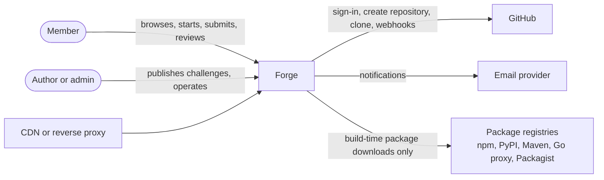

| Neighbour | What flows |
|---|---|
| Member | Uses the website. Pushes code to their own GitHub repository. |
| Author or admin | Publishes challenge content, watches the queue, moderates. |
| GitHub | Identity (OAuth), repository creation (GitHub App), clone at a commit, webhooks on push. |
| Email provider | Outgoing notifications only. Any SMTP or HTTP provider. |
| Package registries | Reached only during image builds, through an allowlist proxy. Never at runtime. |
| CDN or reverse proxy | Terminates TLS and caches public pages. Interchangeable. |

### 3.2 Technical context

| Interface | Protocol | Notes |
|---|---|---|
| Browser to web app | HTTPS, server-sent events for live status | Standard web. No custom client required. |
| Web app to GitHub | HTTPS REST, OAuth 2, GitHub App installation tokens | Tokens scoped to one repository, expire within one hour. |
| GitHub to web app | HTTPS webhooks, HMAC signed | Push and tag events. |
| Web app to worker | Postgres job queue (pg-boss) | No direct network call between them. The queue is the only coupling. |
| Worker to Docker | Local Docker engine API | The worker builds and runs containers on its own host. |
| Worker and web app to storage | S3 API | Reports, logs, screenshots. |

## 4. Solution strategy

| Goal or problem | Approach |
|---|---|
| Grade any language without understanding it | Contract-first, black-box grading. A challenge ships an OpenAPI contract and HTTP test suites. A submission is a repository with a Dockerfile that listens on `PORT` and answers `/health`. The grader only speaks HTTP. |
| Fast, shareable, indexable pages plus live interactivity | Hybrid rendering in Next.js: public pages rendered on the server and cached; client components only for live status, code viewing and editors. |
| One person can run it | A modular monolith (the web app owns all backend modules) plus one separate worker. Two images. Postgres doubles as the job queue. |
| Run anywhere | Docker everywhere, Node runtime only, S3 API for files, environment variables for configuration. |
| Safe execution of stranger's code | Dedicated worker host, gVisor runtime, no egress, strict limits, full teardown, throwaway credentials per run. |
| Growth without rewrite | Stateless web replicas, workers scaled by count, module boundaries enforced by lint so a module can be extracted later. |
| Trustworthy points | Append-only ledger; totals are always derived, never edited. |

## 5. Building block view

### 5.1 Level 1: the whole system

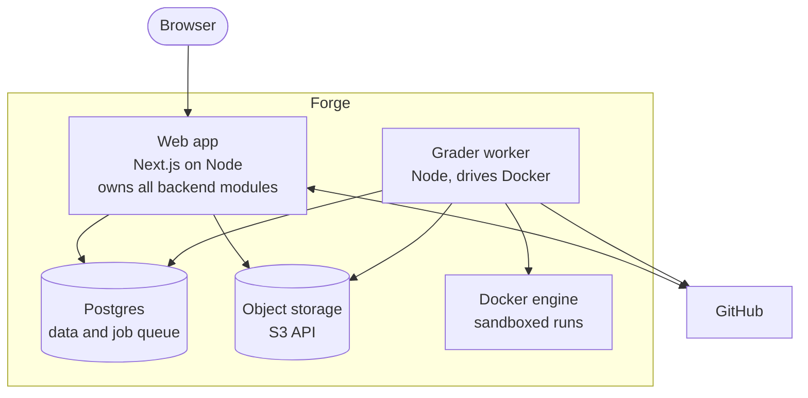

| Block | Responsibility |
|---|---|
| Web app | Serves every page. Owns the backend modules (section 5.2). Talks to GitHub. Enqueues grading jobs and reads their results. |
| Grader worker | Pulls one job at a time, runs the grading pipeline in Docker, writes the report and the score. Has no public network interface at all. |
| Postgres | All state, plus the job queue via pg-boss. One database, two schemas (`app`, `pgboss`). |
| Object storage | Anything bulky: reports, logs, screenshots, generated starter zips. |
| Docker engine | Runs on the worker host only. Builds member images and runs them in isolated networks. |

### 5.2 Level 2: modules inside the web app

The web app is one deployable, but inside it the code is split into modules with hard walls. A module owns its tables and exposes a small public interface. Other modules call that interface or react to its events. A lint rule blocks any import that bypasses the interface.

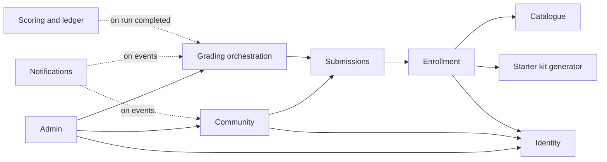

| Module | Owns | Public interface (examples) |
|---|---|---|
| Identity | users, sessions, roles, GitHub tokens | `getCurrentUser`, `requireRole`, `getInstallationToken` |
| Catalogue | challenges, challenge versions, stacks | `listChallenges`, `getChallenge`, `getVersion` |
| Enrollment | enrollments | `startChallenge`, `getEnrollment`, `abandon` |
| Starter kit generator | templates, generation logic | `generateKit(version, stack, mode)`, `pushToGitHub` |
| Submissions | submissions, rate limits | `submit(enrollment, sha)`, `getSubmission`, `streamStatus` |
| Grading orchestration | grading runs, job enqueue, report links | `enqueue(submission)`, `onRunCompleted`, `retry` |
| Scoring and ledger | points ledger, leaderboard snapshots, tiers | `award(run)`, `getLeaderboard(scope)`, `getTotals(user)` |
| Community | solutions, comments, reviews, reports | `publish`, `comment`, `review`, `markHelpful`, `report` |
| Notifications | notifications, email preferences | `notify(user, event)`, `preferences` |
| Admin | audit log | `listQueue`, `retryRun`, `hide`, `suspend` |

Dotted arrows are events: the scoring module does not call grading; it listens for "run completed" and reacts. This keeps the arrows pointing one way and makes extraction possible later.

### 5.3 Level 2: the grading pipeline inside the worker

```mermaid
flowchart LR
  P[Pull job] --> C[Clone at SHA]
  C --> V[Validate contract<br/>Dockerfile, challenge.yml]
  V --> BU[Build image<br/>limits, allowlist egress]
  BU --> R[Start app and services<br/>fresh DB, no internet]
  R --> H[Wait for /health]
  H --> S1[Functional<br/>public and hidden]
  S1 --> S2[Contract conformance]
  S2 --> S3[Robustness]
  S3 --> S4[Quality signals]
  S4 --> SC[Score against rubric]
  SC --> REP[Upload report and logs]
  REP --> T[Teardown everything]
```

Each stage writes a status update to the job, which the web app streams to the member's browser. Any stage can fail; the report then states which stage, why, and what to try. Full-stack mode (v1) adds an end-to-end browser stage after the functional stage. Senior challenges (v2) add a load stage before scoring.

### 5.4 Data view

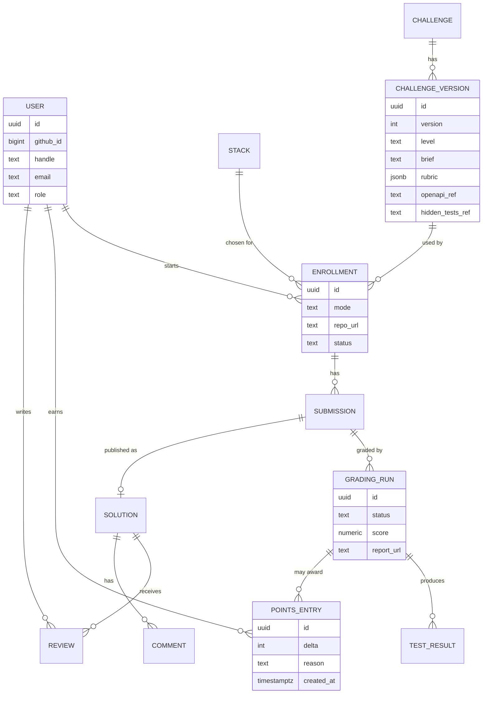

Rules that matter:

- Every table belongs to exactly one module.
- `POINTS_ENTRY` is append-only. Nothing updates or deletes a row. Totals and leaderboards are computed from it and cached.
- `CHALLENGE_VERSION` is immutable once published. Fixes become a new version. Enrollments keep pointing at the version they started with.
- Anything large (reports, logs, screenshots) is a URL into object storage, never a blob in Postgres.

## 6. Runtime view

### 6.1 Start a challenge

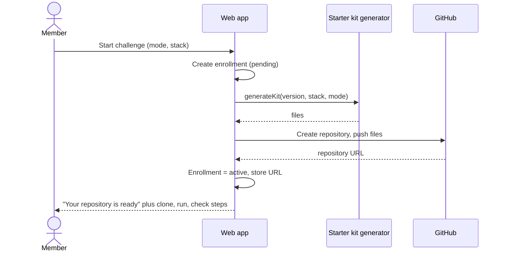

### 6.2 Submit and grade

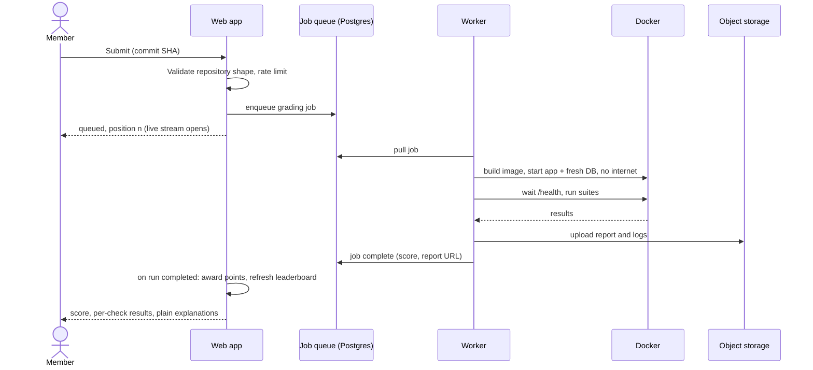

### 6.3 Publish, review, earn

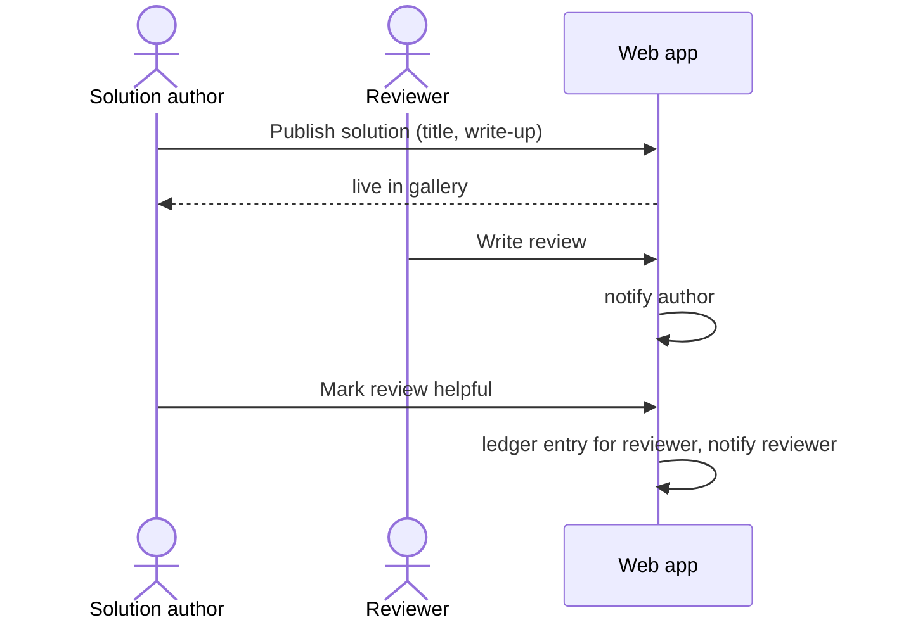

### 6.4 A platform-side failure

Worker crashes halfway through a run: pg-boss sees the job's heartbeat stop, releases it, and another worker (or the same one after restart) picks it up within a minute. The member sees "restarted by the platform" in the status stream. The attempt is not counted against their rate limit.

## 7. Deployment view

### 7.1 Developer laptop

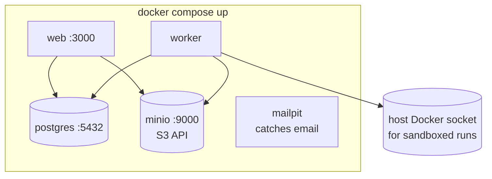

One command starts everything. MinIO stands in for object storage. Mailpit catches outgoing email so nothing real is sent.

### 7.2 Production at MVP

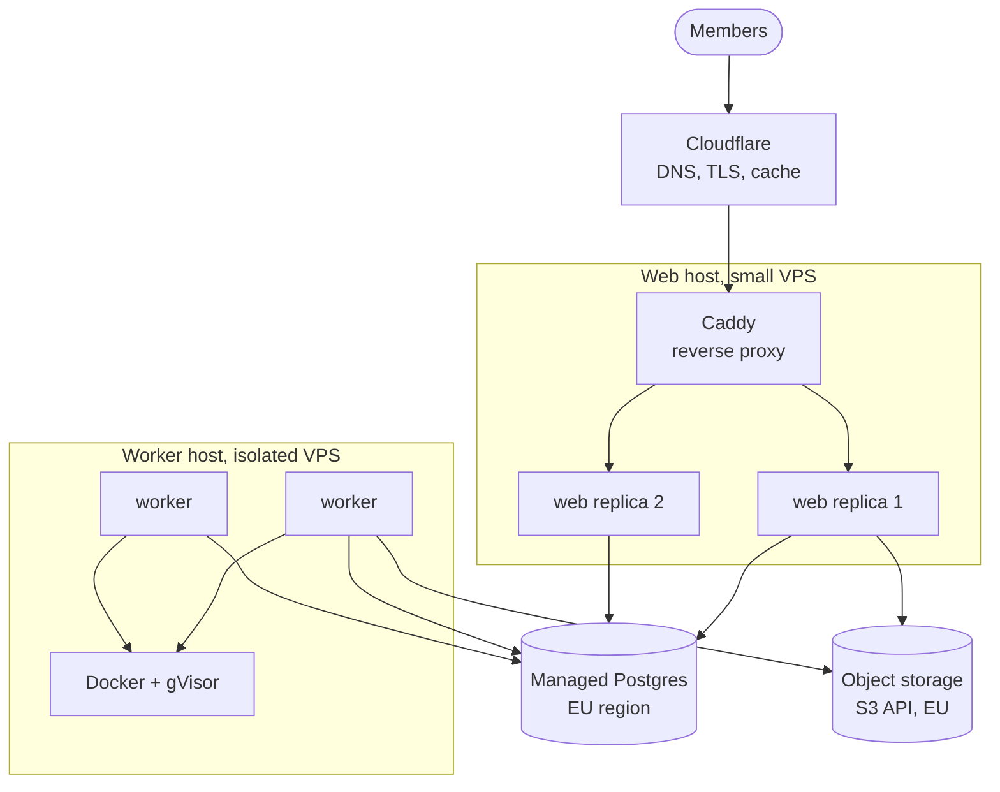

| Piece | MVP choice | Swap for |
|---|---|---|
| Web host | One small VPS running two web containers behind Caddy | Fly.io, any Kubernetes, any VPS |
| Worker host | A separate VPS, no public ports, Docker with gVisor | Larger VPS, more VPSs, Kubernetes jobs, Firecracker |
| Database | Managed Postgres free tier, EU region | Any Postgres |
| Object storage | S3-compatible, EU region | Any S3-compatible service, MinIO |
| Edge | Cloudflare for DNS, TLS and caching | Any CDN or none |

Why two hosts even at MVP: the worker runs untrusted code. Keeping it on a machine with no public ports and nothing else on it is the cheapest strong isolation available.

### 7.3 Scaling path

| Symptom | Action | Code change |
|---|---|---|
| Pages slow under load | Add web replicas, check cache hit rate | None |
| Grading queue grows | Add worker containers or a second worker host | None |
| Database CPU high | Add read replica for leaderboards and public pages | Config only |
| Single host is a risk | Move web to a managed container platform | Config only |

## 8. Crosscutting concepts

### 8.1 Rendering and caching

- Public pages (home, catalogue, challenge, solution, profile, leaderboards) are rendered on the server and cached at the edge with tags. Publishing a solution or finishing a run invalidates only the affected tags.
- Authenticated pages are rendered on the server with a user-specific shell. Client components handle live status (server-sent events), the code viewer and editors.
- No client-side data fetching waterfalls: a page gets its data in one server pass.

### 8.2 Sandbox rules for grading (the hard rule)

1. Member containers run only on the worker host, never on the web host.
2. Each run gets a private Docker network with `internal: true`. No route to the internet.
3. Build stage egress goes only through an allowlist proxy to package registries.
4. Runtime: gVisor (`runsc`), non-root user, read-only root filesystem where the stack allows, dropped capabilities, no privileged mode, no host mounts.
5. Limits per run by level: build ten minutes, boot 60 seconds, junior 1 CPU and 1 GB, mid 2 CPU and 2 GB, senior 2 CPU and 4 GB, process count capped, disk quota.
6. Fresh database with throwaway credentials per run. Platform secrets never enter the run.
7. Everything is destroyed at the end of every run. The worker host is rebuilt from an image on a schedule.

### 8.3 Identity, sessions and authorisation

- Sign-in with GitHub OAuth. A GitHub App installation (separate from OAuth) grants repository creation and webhooks.
- Sessions are database-backed, so any web replica can serve any member.
- Roles: member, author, admin. Checks happen in the module interface, not in the page.

### 8.4 Error handling and explanations

- Every failed check has a stable code, a name and a one-sentence explanation written by the challenge author. The worker never invents messages at runtime.
- Platform errors (timeouts, crashes) are distinguished from member errors (build failed, wrong answer) at the data level, so the UI can say the right thing and the rate limiter can ignore platform errors.
- Logs are structured (JSON), carry the run id, and are viewable by the member for their own runs.

### 8.5 Observability

- OpenTelemetry traces from the web app and the worker into a free-tier backend.
- Four dashboards: queue depth and wait time, grading duration by level and stack, error rate by stage, page performance.
- Alerts: queue wait over 15 minutes, worker heartbeat missing, error rate over 5 percent, disk on worker host over 80 percent.

### 8.6 Data protection

- Lawful basis: contract for running the service; legitimate interests for abuse prevention and similarity checks; consent for optional emails.
- Stored personal data: GitHub id, handle, display name, avatar, primary email, plus anything the member publishes.
- Deletion: removes personal data within 30 days; ledger and audit entries are anonymised so other people's rankings stay correct.
- Retention: build output and logs 90 days, reports for the life of the submission, audit log 12 months.
- Hosting region: UK or EU only, for database and object storage.
- Export: one archive with profile, enrollments, submissions and reports.

### 8.7 Configuration

- Everything from environment variables, validated at start-up, with a single documented example file.
- Same image for development and production. Only the environment differs.

### 8.8 Testing strategy

| Level | What | How |
|---|---|---|
| Unit | Scoring, ledger, starter kit generation, rate limiting | Fast tests, run on every change |
| Module | Each module's public interface against a real Postgres | Test containers |
| Integration | Web app plus worker on one real junior challenge | In CI on every pull request |
| Content | Every challenge: reference solution scores 100, broken solution fails | Gate before publishing |
| End to end | Sign in, start, submit, see result | Playwright against a preview deployment |

### 8.9 Content and versioning

- Challenges and templates live in the repository under `challenges/` and `templates/`. Publishing a challenge writes a new immutable version row and uploads its hidden tests to object storage with a versioned key.
- The worker fetches the hidden tests for the exact version the enrollment started on, so a new version never changes an older run's result.

## 9. Architecture decisions

Each decision is short on purpose. Context, decision, consequences.

### ADR-001 TypeScript end to end

- **Context:** One developer. The web app and the worker share a schema and types. Java or Python for the platform would add a second toolchain for no user-visible benefit.
- **Decision:** TypeScript for the web app (Next.js) and the worker (Node). Java, Python, Go and PHP appear only in starter templates and reference solutions.
- **Consequences:** One language to maintain; shared types between web and worker; the stack templates are the place to keep other languages sharp.

### ADR-002 Modular monolith plus one separate worker

- **Context:** Microservices would multiply deployment and debugging effort for a solo builder. A single process that also runs untrusted code would be unsafe and would block the web tier during grading.
- **Decision:** The web app owns all backend modules with lint-enforced boundaries. Grading runs in a separate worker process behind a queue.
- **Consequences:** Two images. The worker scales independently. Modules can be extracted later if one ever needs it.

### ADR-003 Contract-first, black-box grading

- **Context:** Supporting many languages with language-specific graders would never scale in authoring effort.
- **Decision:** Each challenge ships an OpenAPI contract and HTTP test suites. The grader talks to the running container over HTTP only.
- **Consequences:** Any language works. Adding a stack is a template. Tests must be written against behaviour, never implementation, which also makes them better tests.

### ADR-004 Hybrid rendering, not a single-page app

- **Context:** Public pages must load fast, be shareable and be indexed. A single-page app sends an empty shell first.
- **Decision:** Next.js with server-rendered, cached public pages and client components only where something moves.
- **Consequences:** Best first paint and SEO. Slightly more discipline needed about what runs on the server versus the client.

### ADR-005 Docker-only portability

- **Context:** Quality goal 2. Many hosting platforms offer convenient features that only work on that platform.
- **Decision:** Node runtime only (no edge runtime), standalone Docker output, S3 API for files, Postgres only, environment variables for configuration.
- **Consequences:** Moving hosts is an afternoon. Some platform conveniences are forgone on purpose.

### ADR-006 Postgres as the job queue (pg-boss)

- **Context:** A separate queue service (Redis, a managed queue) is one more thing to run and pay for.
- **Decision:** pg-boss in the same Postgres at MVP.
- **Consequences:** One less service. Reliable retries and heartbeats out of the box. Revisit if job volume makes the database the bottleneck; a swap to Redis and BullMQ is isolated inside the grading orchestration module.

### ADR-007 GitHub as identity and code host

- **Context:** Members already have GitHub accounts and repositories. Hosting code ourselves adds no value.
- **Decision:** GitHub OAuth for sign-in, a GitHub App for repository creation and webhooks.
- **Consequences:** No password management. A dependency on GitHub availability and API limits. GitLab stays possible behind an adapter.

### ADR-008 gVisor for sandboxed runs

- **Context:** Plain Docker shares the host kernel with the container. One kernel bug away from a breach.
- **Decision:** Run member containers under gVisor on a dedicated worker host with no public ports.
- **Consequences:** Strong isolation at low cost. Slight performance overhead that does not matter for grading. Firecracker is the upgrade path.

### ADR-009 Append-only points ledger

- **Context:** Points will need recalculation, fraud reversal and audits. Editing a total in place loses history.
- **Decision:** Every points change is an immutable ledger row. Totals and leaderboards are derived and cached.
- **Consequences:** Full history, easy reversal, trivial audits. Slightly more work to compute totals, solved by snapshots.

### ADR-010 Content as code

- **Context:** Challenges need review, versioning and rollback like any code.
- **Decision:** Challenges and templates live in the repository and are published through a validated pipeline.
- **Consequences:** Pull-request review for content, a publishing gate that refuses untrustworthy tests, and no admin UI for authoring at MVP.

## 10. Quality requirements

### 10.1 Quality tree

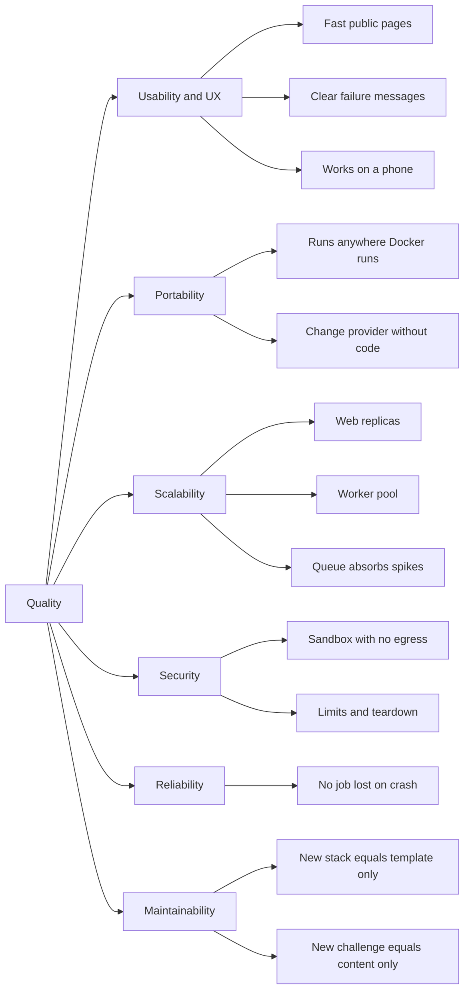

### 10.2 Quality scenarios

Each scenario follows the same shape: who or what triggers it, what happens, what the system does, and how we measure it.

**QS-01 Opening a shared challenge link on a phone (Usability)**

- Source: a member who received a link on WhatsApp
- Stimulus: opens the challenge page on a mid-range phone over 4G
- Environment: normal operation
- Response: the page is readable and the Start button is visible
- Measure: Largest Contentful Paint in 2.0 seconds or less; Start within three taps of the page; no horizontal scrolling at 360 pixels

**QS-02 A failed check (Usability)**

- Source: the grader
- Stimulus: a hidden functional check fails
- Environment: normal operation
- Response: the result page shows the check name, one plain-language sentence and, where safe, the request made and the response received
- Measure: in usability tests, eight out of ten members identify where to look without help

**QS-03 Watching a submission (Usability)**

- Source: a member who just clicked Submit
- Stimulus: the run moves from building to starting to running checks
- Environment: normal load
- Response: the page updates on its own
- Measure: every stage change visible within five seconds, zero manual refreshes

**QS-04 Changing hosting provider (Portability)**

- Source: the owner
- Stimulus: decides to move the web tier from a VPS to a managed container platform
- Environment: planned maintenance
- Response: the same images are deployed with new environment variables and DNS
- Measure: zero code changes; completed within one working day; no data migration beyond the database dump and restore

**QS-05 Changing object storage (Portability)**

- Source: the owner
- Stimulus: switches from one S3-compatible provider to another
- Environment: planned maintenance
- Response: only environment variables change; existing objects are copied with a standard S3 sync tool
- Measure: zero code changes; under two hours

**QS-06 Fresh machine (Portability)**

- Source: a new contributor
- Stimulus: clones the repository on a laptop that has only Docker installed
- Environment: development
- Response: `docker compose up` starts web, worker, database, storage and the mail catcher
- Measure: working system in ten minutes or less including image pulls

**QS-07 Launch-day spike (Scalability)**

- Source: a popular post about the platform
- Stimulus: 500 submissions arrive within one hour, ten times the normal rate
- Environment: normal operation, two workers running
- Response: the queue absorbs every job; members see their position; the owner adds workers
- Measure: zero lost or failed jobs; 95th percentile wait under 15 minutes once workers are added; web 95th percentile response under 500 milliseconds throughout

**QS-08 Viral leaderboard (Scalability)**

- Source: social traffic
- Stimulus: 10,000 visitors open the Go leaderboard within an hour
- Environment: normal operation
- Response: the page is served from cache
- Measure: database reads for that page stay flat; 95th percentile response under 300 milliseconds

**QS-09 Malicious submission tries to phone home (Security)**

- Source: a member with bad intent
- Stimulus: the submitted app tries to open a connection to the internet during a run
- Environment: grading
- Response: the connection is refused by the isolated network; the run is marked failed with the reason; an alert is raised
- Measure: zero bytes leave the sandbox; the worker is healthy for the next job

**QS-10 Runaway process (Security)**

- Source: a buggy or hostile submission
- Stimulus: the app forks processes without limit or fills the disk
- Environment: grading
- Response: process and disk limits stop it; the run fails with a clear reason
- Measure: the worker host stays responsive; the next job starts within one minute

**QS-11 Worker crash (Reliability)**

- Source: hardware or software fault
- Stimulus: a worker process dies in the middle of a run
- Environment: normal operation
- Response: the job is released and picked up again; the member sees "restarted by the platform"
- Measure: job resumed within 60 seconds; the attempt does not count against the member's rate limit

**QS-12 New stack (Maintainability)**

- Source: an author
- Stimulus: adds PHP with Laravel as a stack
- Environment: development
- Response: a new template folder, a template test, a pull request
- Measure: zero changes to grading or web code; live in under one day of work

**QS-13 New challenge (Maintainability)**

- Source: an author
- Stimulus: publishes a new mid-level challenge
- Environment: development and content publishing
- Response: the publishing gate runs the reference solution (must score 100) and the broken solution (must fail)
- Measure: no platform deployment needed; one to two days of authoring; zero false failures in the first month

**QS-14 Account deletion (Data protection)**

- Source: a member
- Stimulus: requests account deletion
- Environment: normal operation
- Response: personal data is removed; ledger and audit rows are anonymised; the export is offered first
- Measure: complete within 30 days; leaderboards of other members unchanged

## 11. Risks and technical debt

| Risk | Likelihood | Impact | Mitigation |
|---|---|---|---|
| Sandbox escape | Low | Severe | Dedicated host, gVisor, no egress, limits, scheduled rebuilds. Never relax for speed. |
| Flaky cross-stack tests (number formats, time zones, trailing slashes, key order) | High | High | Normalise in the runner, specify formats in the contract, validate each challenge against two reference stacks before publishing. |
| Hidden tests leak | Medium | Medium | Versioning and rotation; names and messages only in results. |
| Authoring bottleneck | High | High | Content-as-code pipeline; community authoring with review in v2. |
| GitHub API limits or outage | Medium | Medium | Zip fallback for starters; queued retries for repository creation; clear status messaging. |
| Cold-start community | High | High | Seed with a known cohort, publish solutions early, per-stack boards so small groups still have a real top ten. |
| Single worker host | Medium | Medium | Queue keeps jobs safe; second host is a copy of the first. |
| Next.js host-specific drift | Medium | Low | Lint and review rule: no edge runtime, no provider-only APIs. |

Known debt accepted at MVP: no admin UI for authoring (content as code instead), leaderboards recomputed by a schedule rather than instantly, email optional.

## 12. Glossary

| Term | Plain meaning |
|---|---|
| API | A set of web addresses an app answers. Other programs talk to it instead of people clicking buttons. |
| API contract (OpenAPI) | A written agreement of exactly what each address accepts and returns. The test suite is written against it. |
| Black-box grading | Checking an app only by talking to it from the outside, never by reading its code. |
| Container (Docker) | A sealed box with an app and everything it needs to run, so it behaves the same on any machine. |
| Egress | Outgoing network traffic. The sandbox has none. |
| Enrollment | A member's attempt at a challenge: which version, which mode, which stack, which repository. |
| Full-stack mode | Build the API and the user interface. Backend mode is the API only. |
| gVisor | An extra safety layer that keeps a container away from the host computer's core. |
| Hybrid rendering | Pages are assembled on the server before being sent, with small interactive parts that update in the browser. |
| Ledger | A list where you only ever add lines. Your total is the sum of the lines. |
| Modular monolith | One program with clearly separated rooms inside it, instead of many small programs. |
| Module | One of those rooms. It owns its data and exposes a small set of functions to the others. |
| Queue | A waiting line for jobs. The web app puts jobs in; workers take them out. |
| Replica | Another identical copy of the same container, running at the same time to share the load. |
| Runner contract | The short list of rules a submission must follow so the grader can run it: Dockerfile, listen on PORT, answer /health. |
| S3 API | A common way of storing files that many providers support, so they are interchangeable. |
| Sandbox | The locked room where member code runs during grading. |
| Server-sent events | A simple way for the server to push live updates to the browser. |
| Stack | A language plus a framework, such as Java with Spring Boot. |
| Starter kit | The files a member receives when they start a challenge. |
| Worker | The program that grades submissions. It runs separately from the website. |
